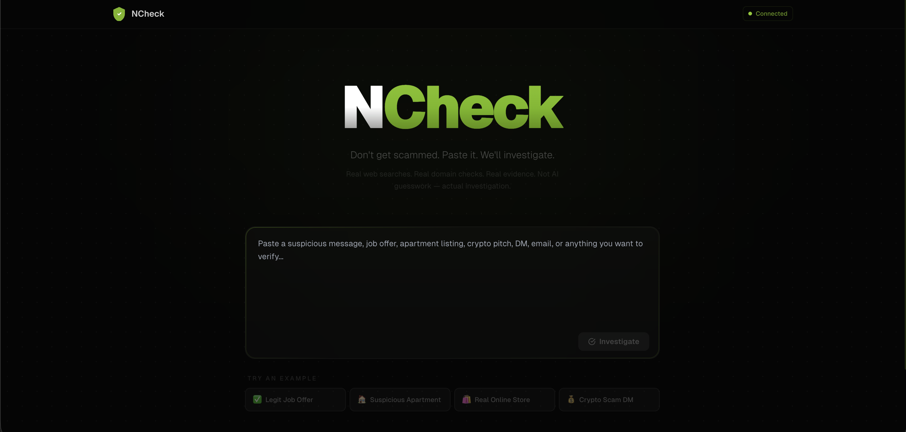

<div align="center">

# 🛡️ NCheck

### Don't get scammed. Paste it. We'll investigate.

*Real web searches. Real domain checks. Real evidence.*
*Not AI guesswork — actual investigation.*



</div>

---

## 🤔 Why NCheck?

We've all been there. You get a message — a job offer that pays way too well, an apartment listing that's suspiciously cheap, a crypto DM promising 300% returns, an email from "your bank" asking you to verify your account.

Your gut says *something's off*, but you're not sure. So you spend 30 minutes googling the company name, checking if the domain is real, looking for scam reports... or worse, you just trust it and lose money.

**NCheck does all that research for you in ~12 seconds.** Paste whatever you received, hit Investigate, and watch as it actually searches the web, checks domain registrations, verifies URLs, and gives you a straight answer backed by real evidence.

No fluff. No "this might be suspicious." Just: *here's what we found, here are the links, here's our verdict.*

---

## ✨ What Makes It Special

Most "scam detection" tools just throw your text at an AI and ask *"is this a scam?"* — the AI guesses based on vibes. NCheck is different:

🌐 **Actually searches the web** — queries DuckDuckGo for scam reports, fraud complaints, and reviews about entities in your content. Returns real links you can click and verify yourself.

📋 **Actually checks domains** — queries the RDAP protocol to find out when a domain was registered. A website that's 3 days old claiming to be an established business? That's a real, verifiable red flag.

🔗 **Actually verifies URLs** — sends HTTP requests to check if URLs resolve, detects sneaky redirects, verifies SSL certificates.

✉️ **Actually validates emails** — checks if email domains exist, flags when someone uses a free Gmail/Yahoo address for "professional business communication."

👀 **Shows you everything** — no black box. A live feed shows every search query, every domain lookup, every URL check as it happens in real-time. Full transparency.

---

## 🔍 How It Works

NCheck runs a **3-stage investigation pipeline** that separates what AI is good at (understanding text) from what requires real data (web lookups):

### Stage 1 — 🧠 Understand
> *"What are we looking at?"*

A single AI call reads the content and figures out:
- What type of content it is (job offer, crypto pitch, rental listing, etc.)
- Every entity mentioned — URLs, emails, company names, phone numbers, crypto wallets
- Red flags — unrealistic claims, pressure tactics, suspicious payment methods
- What to search for — generates targeted queries like `"CompanyName scam"` or `"person fraud review"`

### Stage 2 — 🔎 Investigate
> *"Let's see what the internet says."*

**No AI here — just real HTTP requests running in parallel:**

| What | How | Why |
|------|-----|-----|
| 🌐 Web Search | Scrapes DuckDuckGo results via Cheerio | Find scam reports, complaints, reviews |
| 📋 Domain Age | RDAP protocol query to `rdap.org` | Catch freshly registered scam domains |
| 🔗 URL Check | HEAD requests to each URL | Verify they work, catch redirects |
| ✉️ Email Check | Domain resolution + free provider detection | Catch fake business emails |

Everything streams back live — you see each search happening, each result coming in.

### Stage 3 — ⚖️ Verdict
> *"Here's what we found."*

The AI gets the original content plus **all the real evidence** from Stage 2 — actual search results with URLs, actual domain ages, actual URL check results — and produces:

- 📊 **Trust Score** (0-100) with transparent deductions
- 🚦 **Severity Rating** — from SAFE to CRITICAL DANGER
- 📝 **Detailed Verdict** citing specific evidence
- 🚩 **Key Flags** with severity and source attribution
- 🔗 **Clickable Sources** — real URLs so you can verify yourself
- ✅ **Recommendations** — specific next steps

---

## 📊 Scoring

Points start at **100** and get deducted based on what's found:

| Finding | Deduction |
|---------|-----------|
| 🚩 Critical red flag in content | -15 |
| ⚠️ High red flag in content | -10 |
| 📋 Domain registered < 30 days ago | -20 |
| 📋 Domain registered < 90 days ago | -10 |
| ✉️ Free email used for business | -8 |
| 🔗 URL doesn't resolve / suspicious redirect | -12 |
| 🌐 Scam reports found in web search | -20 each |
| 💰 Unrealistic financial claims | -15 |
| ⏰ Pressure/urgency tactics | -10 |

| Score | Rating | What it means |
|-------|--------|---------------|
| 80-100 | 🟢 **SAFE** | Looks legit |
| 60-79 | 🟡 **LOW RISK** | Probably fine, minor concerns |
| 40-59 | 🟠 **MODERATE RISK** | Sketchy — verify before engaging |
| 20-39 | 🔴 **HIGH RISK** | Likely fraud — don't engage |
| 0-19 | ⛔ **CRITICAL DANGER** | Almost certainly a scam |

---

## 🚀 Quick Start

### Prerequisites

- **Node.js 18+** — [download here](https://nodejs.org/)
- **NVIDIA API Key** (free) — [get one here](https://build.nvidia.com/)

### Setup

```bash
# Clone it
git clone https://github.com/YOUR_USERNAME/NCheck.git
cd NCheck

# Install dependencies
npm install

# Set up your API key
cp .env.example .env
# Edit .env and paste your NVIDIA API key
```

### Run

```bash
npm run dev
```

Open [http://localhost:3000](http://localhost:3000) and paste something suspicious 🕵️

---

## 🌐 Deploy

Deploy to Vercel in 3 clicks:

1. Push to GitHub
2. Import on [vercel.com](https://vercel.com) → "Add New Project"
3. Add env var: `NVIDIA_API_KEY` → your key
4. Hit Deploy 🚀

Live in ~60 seconds.

---

## 🏗️ Architecture

```
CLIENT                                    SERVER
──────                                    ──────

┌─────────────┐   POST /api/stream    ┌──────────────────────┐
│             │   ─────────────────►   │  🧠 UNDERSTAND       │
│   Paste     │                        │  AI: classify +      │
│   content   │                        │  extract entities    │
│             │                        └──────────┬───────────┘
│   LiveFeed  │   ◄── SSE stream ──              │
│   (real-    │                        ┌──────────▼───────────┐
│    time)    │                        │  🔎 INVESTIGATE       │
│             │                        │  Web search (DDG)    │
│   Verdict   │                        │  Domain check (RDAP) │
│   Card      │                        │  URL verify (HTTP)   │
│             │                        │  Email check         │
└─────────────┘                        └──────────┬───────────┘
                                                  │
                                       ┌──────────▼───────────┐
                                       │  ⚖️ VERDICT           │
                                       │  AI + real evidence   │
                                       │  → score + sources   │
                                       └──────────────────────┘
```

---

## 📁 Project Structure

```
NCheck/
│
├── src/
│   ├── app/                        # 🖥️  Next.js App Router
│   │   ├── api/stream-analyze/     #     SSE streaming endpoint
│   │   ├── page.tsx                #     Main UI
│   │   ├── layout.tsx              #     Root layout
│   │   ├── globals.css             #     Styles & animations
│   │   └── fonts/                  #     Geist font files
│   │
│   ├── components/                 # 🧩 React Components
│   │   ├── LiveFeed.tsx            #     Real-time investigation log
│   │   ├── VerdictCard.tsx         #     Results + evidence + sources
│   │   └── TrustScoreGauge.tsx     #     Circular score gauge
│   │
│   ├── services/                   # 🔌 External Integrations
│   │   ├── nvidia.ts               #     NVIDIA Nemotron LLM client
│   │   └── research.ts            #     Web search, domain & URL checks
│   │
│   ├── config/                     # ⚙️  Configuration
│   │   ├── prompts.ts              #     LLM system prompts
│   │   └── examples.ts            #     Demo example inputs
│   │
│   └── types/                      # 📐 TypeScript Types
│       └── index.ts                #     Shared type definitions
│
├── .env.example                    # 🔑 Env var template
├── package.json                    # 📦 Dependencies
├── tailwind.config.ts              # 🎨 Tailwind + NVIDIA colors
└── README.md                       # 📖 You are here
```

---

## 🛠️ Tech Stack

| | Technology | What it does |
|---|-----------|-------------|
| ⚡ | **Next.js 14** | App framework with SSR + API routes + streaming |
| 🧠 | **NVIDIA Nemotron** | AI model for content analysis and verdict |
| 🌐 | **Cheerio + DuckDuckGo** | Real web search result scraping |
| 📋 | **RDAP Protocol** | Domain registration age lookups |
| 📡 | **Server-Sent Events** | Real-time streaming to the browser |
| 🎨 | **Tailwind CSS** | Dark glassmorphic UI styling |
| 📐 | **TypeScript** | Type safety everywhere |

---

## 💡 Use Cases

- 💼 **Got a job offer?** — Paste it. We'll check if the company is real and the salary makes sense.
- 🏠 **Found a cheap apartment?** — Paste the listing. We'll check the domain, the email, and search for scam reports.
- 💰 **Received a crypto DM?** — Paste it. We'll flag the fake testimonials, check the wallet, and find fraud reports.
- 🛒 **Shopping on an unknown site?** — Paste the product page. We'll verify the domain age and look for complaints.
- 📧 **Suspicious email?** — Paste it. We'll check every link, every domain, every claim.

---

## ⚠️ Honest Limitations

- Web search results depend on DuckDuckGo — coverage may vary from server IPs
- Not all domain TLDs support RDAP — some domain ages may be unavailable
- AI analysis assists human judgment, it doesn't replace it
- No persistent scam database — searches the public web each time
- 30-second timeout on Vercel hobby plan for streaming responses

---

## 🤝 Contributing

Ideas for making NCheck even better:

- 🔒 Add VirusTotal / Google Safe Browsing API integration
- 🌍 Add more search engines (Brave Search, SearXNG)
- 💾 Add analysis history / saved reports
- 🧩 Build a browser extension for one-click page scanning
- 🌏 Support non-English content analysis

PRs and issues welcome!

---

## 📄 License

MIT — use it, modify it, ship it. Just don't get scammed. 🛡️
